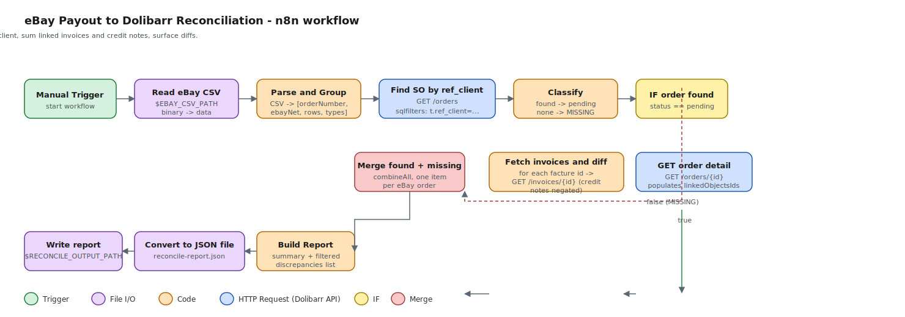

# Dolibarr ↔ eBay Reconciliation

Reconciles an eBay payout CSV against Dolibarr sales orders, invoices, and credit notes.

## How matching works

1. Read the eBay payout CSV, find the header row (`Transaction creation date,...`).
2. Group every row by **Order number**, summing the **Net amount** column.
3. For each unique Order number, look up the Dolibarr Sales Order where
   `ref_client = <Order number>` (exact match) via `GET /api/index.php/orders?sqlfilters=(t.ref_client:=:'…')`.
4. Refetch by id (`GET /api/index.php/orders/{id}`) so `linkedObjectsIds.facture` is populated.
   The list endpoint leaves this null.
5. For every linked invoice / credit note id, fetch via `GET /api/index.php/invoices/{id}`,
   sum `total_ht`. Credit notes (`type == 2`) are negated.
6. Compare eBay net vs Dolibarr net per order; classify as `MATCH`, `MISMATCH`,
   `MISSING_IN_DOLIBARR`, or `NO_LINKED_INVOICES`.

## Web UI (recommended)

```bash
python3 -m venv venv
source venv/bin/activate          # Windows: venv\Scripts\activate
pip install -r requirements.txt
export N8N_WEBHOOK_URL=https://n8n.txscorp.com/webhook/ebay-reconcile
export DOLIBARR_URL=https://staging.txscorp.com   # only used to label the topbar
uvicorn app:app --reload --port 8000
```

The FastAPI app no longer talks to Dolibarr directly — it forwards the uploaded
CSV to n8n, which holds the Dolibarr API key in its Credentials store and
performs every API call. The UI normalises the JSON response and renders the
same summary + table + downloads.

Open <http://localhost:8000>, drop the payout CSV, hit **Reconcile**. The page shows
a summary, a filterable / sortable table of every order, and **Download CSV** /
**Download JSON** buttons for the same report.

Endpoints (also callable directly):
- `POST /api/reconcile`     - multipart `file`, returns `{summary, results}` JSON
- `POST /api/reconcile.csv` - same input, returns CSV download

A full run against the 106-order sample CSV against `staging.txscorp.com` takes
about 1m45s (two Dolibarr API calls per order plus one per linked invoice). The
UI shows a spinner during the call.

## CLI

```bash
export DOLIBARR_API_KEY=<key>
export DOLIBARR_URL=https://staging.txscorp.com   # default

python3 reconcile.py "eBay Payout_7461554484_TXS - 4-21-26 (1).csv"

# JSON for downstream tooling
python3 reconcile.py payout.csv --json --only mismatch > mismatches.json
```

Flags: `--tolerance 0.01`, `--only {mismatch,missing,no_invoices,all}`, `--json`.

## n8n workflow

- `n8n-reconcile.json` — importable workflow.
- `n8n-reconcile.svg` — rendered node graph.

Required env vars on the n8n instance: `DOLIBARR_URL`, `DOLIBARR_API_KEY`,
`EBAY_CSV_PATH`, optionally `RECONCILE_OUTPUT_PATH` (defaults to `/tmp/reconcile-report.json`).

Node flow:



## Sample run (Apr 21, 2026 payout)

```
Orders compared       : 106
Matches (|diff| <= 0.01): 40
Mismatches            : 52
Missing in Dolibarr   : 11
No linked invoices    : 3
```

The 52 mismatches are dominated by orders whose sale settled in a *previous* payout
but whose fees (Promoted Listings, FVF) appear in this payout — so the eBay net here
is a small negative fee delta while Dolibarr still carries the full invoice total.
That is the reconciliation gap the user wants visibility into.
