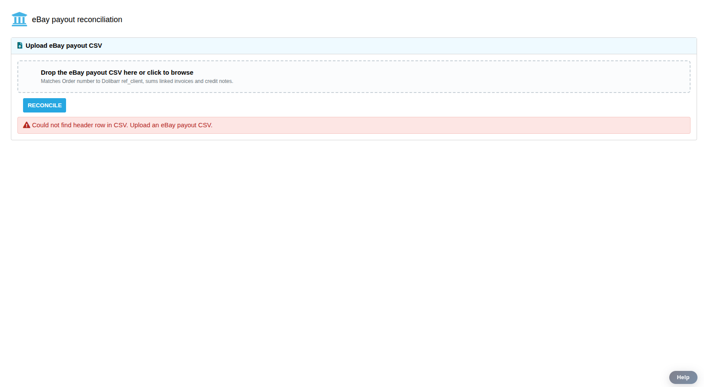
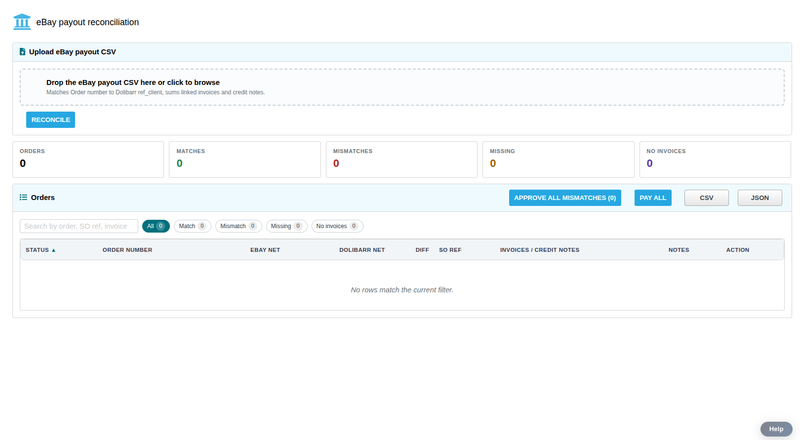
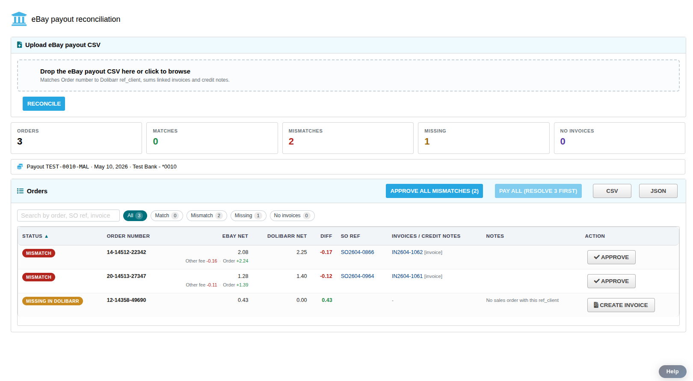
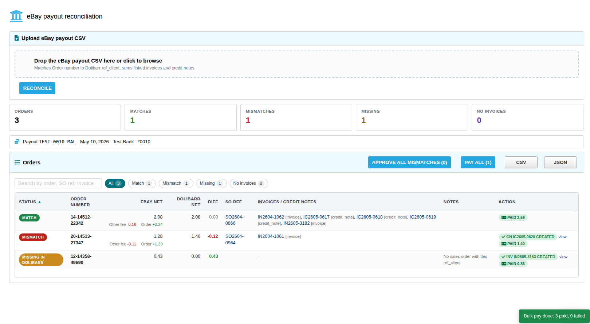
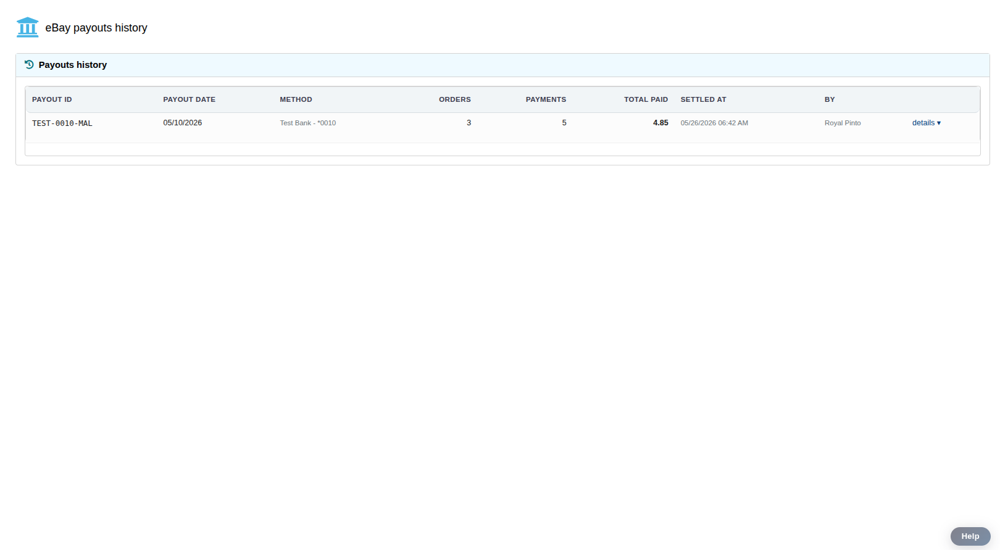

# Testing the eBay Reconciliation module

A walkthrough of where to go in Dolibarr, what each screen does, and 12
hand-picked test CSVs to exercise the edge cases before trusting it on real
data.

If you haven't installed the module yet, do that first ([SETUP.md](../docs/SETUP.md)).
This doc assumes the module is enabled and your user has the `use` and
`write` permissions.

---

## Where to find it in Dolibarr

1. Log in to Dolibarr.
2. In the **top menu**, click **Bank/Cash** (sometimes labelled "Banks" or
   "Bank/Cash" depending on your install language).
3. In the **left sidebar** that appears, you'll see a new group called
   **eBay payouts** with two sub-items:
   - **Reconcile a payout** — upload a CSV here.
   - **Payouts history** — list of payouts you've previously settled.

If you don't see the menu group, see
[TROUBLESHOOTING.md → "Menu entry doesn't appear"](../docs/TROUBLESHOOTING.md#menu-entry-doesnt-appear-under-bankcash).

---

## Step 1 — Upload your payout CSV

Click **Bank/Cash → eBay payouts → Reconcile a payout**.

You'll see an upload panel at the top of the page:

- **Drop a CSV onto the dashed box**, or click it to browse and pick a file.
- Hit the **Reconcile** button.
- Wait ~10–30 seconds for a typical payout (~100 orders). The module queries
  Dolibarr's database directly to match every order.

> Don't have a real payout to test with? Use any file from the [test
> suite below](#the-test-suite) — they're real eBay CSV format, sized so you
> can step through each scenario without overwhelming the screen.

---

## Step 2 — Read the result

Once reconciliation finishes you'll see two things:

### Summary tiles

Five number cards at the top:

| Tile | What it means |
|------|---------------|
| **Orders** | How many unique eBay orders are in the payout |
| **Matches** | Orders where the eBay total = Dolibarr total. Nothing to do but Pay all later |
| **Mismatches** | Orders where the totals disagree. Will need an **Approve** click |
| **Missing** | eBay orders with NO sales order in Dolibarr. Will need a **Create invoice** click |
| **No invoices** | Orders with a Dolibarr SO but no invoice yet. Will need a **Create invoice** click |

The numbers should always add up: `Matches + Mismatches + Missing + No invoices = Orders`.

### The orders table

One row per eBay order. Important columns:

- **Status badge** (left): colour-coded — green Match, red Mismatch, orange
  Missing, purple No invoices.
- **Order number**: the eBay order number from the CSV.
- **eBay net**: the amount eBay paid you for this order. If multiple CSV
  rows aggregated (e.g. a sale + a fee + a refund), they're listed
  underneath in small grey text — that's the **breakdown**.
- **Dolibarr net**: what Dolibarr currently shows for this order.
- **Diff**: eBay − Dolibarr. Coloured green/red so the mismatch direction
  is visible at a glance.
- **SO ref** and **Invoices / credit notes**: clickable, open the
  underlying Dolibarr record in a new tab.
- **Action**: the button you need to click (or already-done chip if
  you've acted on this row).

Above the table you've got:

- A **search box** (type any order, SO, or invoice ref).
- **Status filter chips** (All / Match / Mismatch / Missing / No invoices)
  with live counts.
- **Approve all mismatches (N)** — bulk action button (only appears when
  there are unapproved mismatches).
- **Pay all (N)** — bulk action button (only enables once nothing is unresolved).
- **CSV** and **JSON** downloads of the current results.

---

## Step 3 — Fix what doesn't match

Each non-Match row tells you what to click.

### MATCH — nothing to do

Skip. Pay all (Step 4) will close it out.

### MISMATCH — click **Approve**

eBay's total differs from Dolibarr's. A modal opens showing exactly what's
about to happen:

- The diff amount
- Whether it'll create a **Credit note** (negative diff) or an additional
  **Invoice** (positive diff)
- Which existing invoice the new doc will reference

Click **Confirm**. The module:
1. Creates the credit note (or invoice) in Dolibarr as a draft.
2. Validates it — assigns a real ref like `IC2605-0521`.
3. Stops. The row turns green and shows a `CN <ref> created` chip.

Next time you reconcile this order, it'll show MATCH because the
reconciler sums the new CN alongside the original invoice.

> **Bulk shortcut:** if you have many mismatches with no surprises, use the
> blue **Approve all mismatches (N)** button instead of clicking each row.

### MISSING IN DOLIBARR — click **Create invoice**

No record exists in Dolibarr for this eBay order. A modal opens showing:

- The customer the invoice will go under (defaults to your configured eBay
  customer — `socid 3657` in our staging)
- The eBay net total
- Every CSV row that'll become a line item

Click **Confirm**. The module creates the invoice in Dolibarr under that
customer, validates it, assigns a real ref. The row turns green with
`INV <ref> created`.

### NO LINKED INVOICES — click **Create invoice**

Same as MISSING, except the row already has a Sales Order in Dolibarr. The
modal will say *"Linking to SO `SO2604-XXXX`"* — the new invoice gets
properly attached to that SO via the `origin` field.

---

## Step 4 — Mark everything paid

Once **every** row is either originally MATCH or has been adjusted, the
green **Pay all (N)** button lights up at the top of the table.

> If it's greyed out with text *"Pay all (resolve N first)"*, there's still
> work to do. Filter to the remaining red/orange/purple rows.

Click **Pay all**. The module:

1. For each unpaid invoice, creates a payment record in Dolibarr.
2. Uses the payout's own metadata from your CSV:
   - **Payout ID** as the payment reference (e.g. `7461554484`).
   - **Payout date** as the payment date.
   - Credits the bank account you configured during install
     (default: CityNational, `id=1`).
   - Payment method `VIR` (Credit Transfer, `id=2`).
3. Marks each invoice as paid (`paye = 1` in Dolibarr).
4. Skips any invoice where remain-to-pay is ≤ 0 (e.g. a customer-credit
   case — nothing to pay).

You'll see a progress indicator, then a green toast: *"Bulk pay done: X
paid, Y failed."*

---

## Step 5 — Review what happened

Click **Bank/Cash → eBay payouts → Payouts history** in the left sidebar.

Every Pay-all run produces one row here:

- Payout ID, date, method
- Orders count, payments count, total paid
- When and by whom
- A **`details ▾`** link that expands a per-payment sub-table with
  clickable SO and invoice refs

Data lives in Dolibarr's database, so anyone with the `use` permission can
see it — across browsers, machines, sessions.

---

## The test suite

12 CSVs that exercise the edge cases worth testing before going live.

Each file uses the same eBay format as your real payout (preamble + header
row at line 13 + 36 data columns). Where rows are taken from real orders,
their Order numbers are real and Dolibarr will (hopefully) find SOs for
them. Where rows are synthetic, the Order numbers start with `99-FAKE-`
or `99-GHOST-` so they're easy to spot and won't collide with real eBay
data.

Regenerate any time with:

```bash
cd Dolibarr-EBay/test-csvs
python3 generate.py
```

| File | What it tests | Expected outcome |
|------|---------------|------------------|
| `01-tiny-positive.csv` | Smallest valid payout (1 order, 1 row, +0.43) | MATCH or MISMATCH depending on whether `12-14358-49690` has a Dolibarr SO matching the amount |
| `02-tiny-negative.csv` | Smallest negative payout (1 order, 1 row, -0.33) | Tests negative-net handling and the diff display |
| `03-multi-row-order.csv` | One order with 4 CSV rows summing to zero | Confirms the **per-row breakdown** displays correctly under the eBay net cell. Also confirms zero-net handling. |
| `04-small-mixed.csv` | 5 orders, mix of positive and negative | Tests typical mixed-status reconciliation in miniature |
| `05-positive-only.csv` | 10 highest-positive-net orders | Tests several MATCH / MISMATCH rows at once; bulk Approve should work |
| `06-negative-only.csv` | All 22 negative-net orders from the original | Heaviest stress test for the credit-note creation flow |
| `07-large-amounts.csv` | 5 highest-magnitude orders ($500+) | Verifies number formatting and large-amount display |
| `08-all-synthetic.csv` | 5 fake order numbers (`99-FAKE-...`) | **All 5 should be `MISSING_IN_DOLIBARR`**. Tests the "Create invoice (no SO)" flow under your default eBay customer. Includes a zero-net row, a refund-only row, and a row with both Order + fee. |
| `09-medium-mixed.csv` | 25 real orders across the value spectrum | Realistic dress-rehearsal before the full 106 |
| `10-malformed-rows.csv` | 3 good orders + 3 deliberately-malformed rows | Tests the parser's silent-skip behaviour: rows with `--` for Order number or Net amount, and a non-numeric net, should all be ignored without an error |
| `11-empty.csv` | Header row present, no data | Tests empty-input handling — should produce "no rows" gracefully |
| `12-no-header.csv` | No eBay header at all | Should error cleanly with "Could not find header row" — tests bad-file rejection |

## Recommended testing order

For a fresh install on staging where you want to verify behaviour cleanly:

### 1. `12-no-header.csv` — bad input is rejected cleanly

Upload a CSV that doesn't even have the eBay header. The module should reject
it with a clear error message, not crash.



Result: red error banner *"Could not find header row in CSV. Upload an eBay
payout CSV."* — no half-rendered table, no PHP trace dump.

### 2. `11-empty.csv` — empty CSV produces an empty report

Upload a CSV with only the header row (no data). The module should treat
this as "zero orders to process", not as an error.



Result: all summary tiles read `0`, the table renders with the empty
message *"No rows match the current filter."* All buttons disabled or
absent. Nothing crashes.

### 3. `10-malformed-rows.csv` — silently skip garbage rows

Upload a CSV that has 3 real orders + 3 deliberately-malformed rows
(missing order number, missing net, non-numeric net). The parser should
silently drop the bad ones while processing the 3 good ones.



Result: summary shows 3 orders processed (not 6 — the garbage rows are
gone). The breakdown text under "eBay net" (e.g. `Other fee -0.16 · Order
+2.24`) confirms multi-row orders are grouping correctly. Notice the
payout banner: *Payout TEST-0010-MAL · May 10, 2026 · Test Bank - *0010*
— payout metadata extracted from the CSV header correctly.

Now exercise the full workflow — click **Approve** on the Mismatches, **Create invoice** on the Missing, then **Pay all**:



Result: row `14-14512-22342` is now MATCH (its CN sums with the existing
invoice to equal the eBay net). Other rows show their `CN <ref> CREATED`
or `INV <ref> CREATED` chips and `PAID <amount>` confirmations. The
bottom-right toast: *"Bulk pay done: 3 paid, 0 failed."*

### 4. Verify Payouts history

Sidebar → **Payouts history**. The just-settled payout should appear:



One row per settled payout: ID, date, method, orders count, payments
count, total paid, when, by whom. The `details ▾` link expands to show
every individual payment with clickable SO / invoice refs.

---

### Remaining tests (no screenshots yet)

4. **`01-tiny-positive.csv`** — simplest happy path. One row, one order. If anything in the rendering pipeline is broken, this surfaces it.
5. **`02-tiny-negative.csv`** — same but negative net. Tests diff sign rendering.
6. **`03-multi-row-order.csv`** — confirm the per-row breakdown shows under the eBay net cell (4 rows summing visibly).
7. **`08-all-synthetic.csv`** — 5 guaranteed-missing rows. Click **Create invoice** on one of them and confirm the new invoice appears in Dolibarr under your default eBay customer (socid 3657).
8. **`04-small-mixed.csv`** — 5 mixed-sign real orders. Test Approve on any MISMATCH, then click Pay all.
9. **`07-large-amounts.csv`** — verify $500+ amounts render correctly.
10. **`09-medium-mixed.csv`** — 25-order dress rehearsal.
11. **`06-negative-only.csv`** — heavier credit-note creation stress test.
12. **`05-positive-only.csv`** — bulk Approve happy path.
